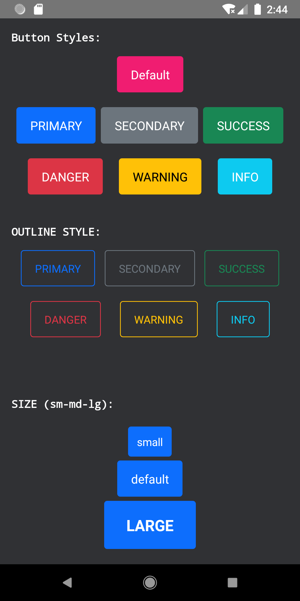

# Library Introduction
 React native bootstrap buttons.

 

[](https://nodei.co/npm/react-native-buttons-bootstrap/)

## Getting Started
###### Demo


### Installation

```bash
npm i react-native-buttons-bootstrap --save
```

### Usage

###### exemple
```jsx
import { BtsrpBtn } from "react-native-buttons-bootstrap/lib/module";
```

```jsx
<BtsrpBtn btnText="Exemple" btnStyle="primary" btnRadius={-1} custumTextStyle={{textTransform:"uppercase"}} onPress={()=>{console.log("stop it!")}}  />

```

### Properties
###### (non of the props is required)

| Prop Name  | Type         |Default Value  |
| -----------|:------------:|---------------|
|btnText     | string       | "DEFAULT"     |
|btnStyle    | string enum  "primary","secondary","success","danger","warning","info","outlinePrimary","outlineSecondary","outlineSuccess","outlineDanger","outlineWarning" ,"outlineInfo" | null      |
|btnRadius   | number       | 4             |
|custumTextStyle | Object   | null          |
|onPress     | void         | null          |
|onLongPress | void         | null          |


